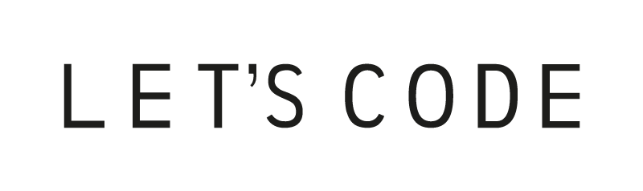

<!--Banner session-->

<!--Banner session-->

<h1 align="center">
Let's Code Pass | Comunidade de dev para dev

[PT/PT]
Portfólio criado com o intuito de mostrar meus projetos ao decorrer da minha carreira.

[EN/EN]
Portfolio created in order to show my projects throughout my career

### Studying and looking for new challenges in the [Let's Code Pass](https://letscode.com.br/lets-code-pass) / Estudando e buscando novos desafios no [Let's Code Pass | Comunidade de dev para dev](https://letscode.com.br/lets-code-pass).
 

 
 ### Activity performed from the Java course / Atividade realizada do curso Java - [Click here/Clique aqui ver a Lista de Exercicios](./exercicio/Lista_de_Exercicios_Java_Code_One.pdf).
 
 
 
  
  

<!-- Ícones das linguagens -->
<!-- Java -->

